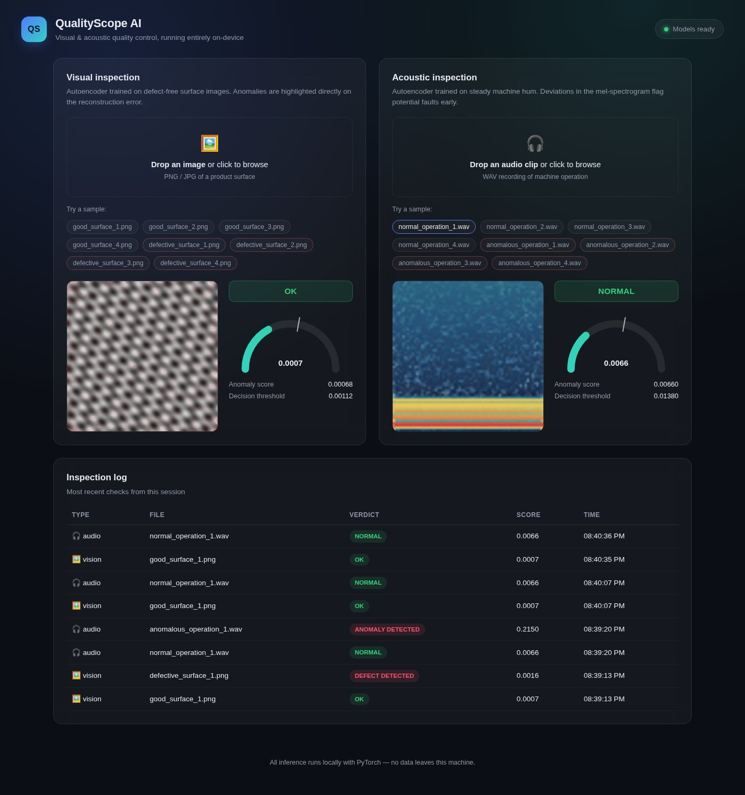

# QualityScope AI

A small, fully offline visual and acoustic inspection tool. It watches for
two things that show up on real production lines: surface defects on parts
(scratches, pits, stains) and abnormal machine sounds (knocks, bearing wear,
grinding noise). Both run through convolutional autoencoders trained with
PyTorch and served through a FastAPI backend with a lightweight web UI.



## Why an autoencoder

Labeled defect datasets for a specific product line rarely exist up front,
but a pile of "known-good" images or recordings usually does. An autoencoder
trained only on that good data learns to reconstruct it well; anything it
was never shown - an actual defect, an unusual noise - gets reconstructed
poorly. The reconstruction error itself becomes the anomaly signal, and
because it's computed per-pixel (or per-spectrogram-cell), it doubles as a
heatmap that points at *where* the anomaly is, not just that one exists.

This is the same idea behind approaches like PaDiM/PatchCore for visual
inspection and autoencoder-based acoustic condition monitoring (e.g. the
MIMII-style literature) - just implemented at a scale that trains in under
a minute on a laptop CPU.

## What's inside

- **Visual inspection** - drop in a product photo, get a defect / no-defect
  verdict plus a heatmap overlay showing which region triggered it.
- **Acoustic inspection** - drop in a WAV recording of a running machine,
  get a normal / anomaly verdict plus a spectrogram with the flagged region
  highlighted.
- **Inspection log** - a running history of everything checked in the
  current session.
- **Ready-to-try samples** - both modules ship with generated normal and
  defective/anomalous examples, so there's something to click on before you
  bring your own files.

No cloud APIs, no accounts, no telemetry. Everything - model inference,
sample data, the web UI - runs on `localhost`.

## Honest disclosure about the data

There's no proprietary factory dataset behind this. `scripts/generate_data.py`
and the training scripts synthesize both classes:

- **Visual**: a repeating grating-based texture standing in for a machined
  surface, with scratches/pits/stains painted on for the defective class.
- **Acoustic**: a motor-hum waveform (a fundamental frequency plus decaying
  harmonics) for normal operation, with knocks, periodic bearing-style
  clicks, or bursts of grinding noise added for the anomalous class.

The point of the project is the detection pipeline - preprocessing, model
architecture, thresholding, serving, and visualization - which is exactly
what you'd reuse against a real dataset from an actual production line.

## Tech stack

- **PyTorch** - convolutional autoencoders for both modalities
- **torchaudio** - mel-spectrogram feature extraction
- **FastAPI + Pydantic** - typed request/response models and the HTTP API
- **Vanilla HTML/CSS/JS** - no build step, no CDN dependency, works fully
  offline once installed

## Project layout

```
server/
  main.py            FastAPI app and routes
  schemas.py         Pydantic request/response models
  config.py          Settings (pydantic-settings)
  history.py         In-memory inspection log
  vision/
    dataset.py       Synthetic texture + defect generation
    model.py         ConvAutoencoder architecture
    inspector.py     Inference, scoring, heatmap rendering
  audio/
    dataset.py       Synthetic machine-sound generation + spectrograms
    model.py         Autoencoder (reuses the vision architecture)
    inspector.py     Inference, scoring, spectrogram rendering
  models_store/      Trained checkpoints (generated, not committed)
frontend/
  index.html, styles.css, app.js   The web UI
scripts/
  generate_data.py   Ready-to-try sample files
  train_vision.py    Trains and saves the vision autoencoder
  train_audio.py     Trains and saves the audio autoencoder
tests/               pytest suite
```

## Setup

Requires Python 3.11+.

```bash
python3 -m venv .venv
source .venv/bin/activate        # Windows: .venv\Scripts\activate
pip install -r requirements.txt
```

Generate sample files and train both models (all synthetic, no external
data or internet access required - this takes well under a minute on CPU):

```bash
python scripts/generate_data.py
python scripts/train_vision.py
python scripts/train_audio.py
```

Each training script prints validation vs. anomaly reconstruction-error
statistics and the fraction of synthetic anomalies caught at the chosen
threshold, so you can see the separation before ever opening the UI.

## Running it

```bash
uvicorn server.main:app --reload
```

Open http://127.0.0.1:8000 and either drag in a file or click one of the
"Try a sample" buttons.

## Running the tests

```bash
pytest
```

The dataset/model unit tests run standalone. The end-to-end inspector tests
train a small throwaway model on the fly (a few seconds) so the suite
doesn't depend on the checkpoints in `server/models_store/`. The API tests
do use those checkpoints and are skipped automatically if you haven't run
the training scripts yet.

## Configuration

A few defaults can be overridden with environment variables (see
`server/config.py`):

| Variable                        | Default | Meaning                          |
|----------------------------------|---------|-----------------------------------|
| `QUALITYSCOPE_MAX_UPLOAD_MB`      | 15      | Max accepted upload size          |
| `QUALITYSCOPE_HISTORY_LIMIT`      | 25      | Entries kept in the inspection log|

## Limitations

- The "normal" class for each module is intentionally narrow (one fixed
  texture pattern, one fixed motor pitch) so the small demo models can
  separate anomalies cleanly. A production deployment would train on real
  captures from the specific line/machine being monitored, with a larger
  and more varied "normal" set.
- Audio anomaly detection assumes a roughly steady-state sound (a running
  motor/compressor), not arbitrary audio.
- This is a portfolio-scale project: no auth, no persistence across
  restarts (the inspection log is in-memory), no batch processing.

## License

MIT
